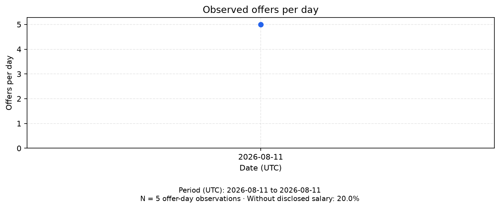
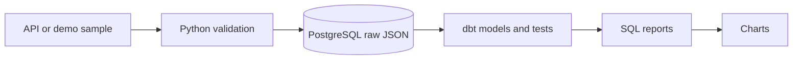

# Poznań IT Market


A Python and SQL project that collects IT job offers from JustJoinIT and builds reports for Poznań.



Demo chart: **5 offer observations on 2026-08-11**.
Source: [saved JustJoinIT sample](data/raw/sample/jjit_2026-08-11.json).

[Read the demo report](docs/reports/demo-2026-08-11.md) - verified on 2026-10-09.

## Why this exists

As a student looking for my first IT job, I wanted to learn more about the local job market.
I built this project to practise API requests, PostgreSQL, dbt, testing and GitHub Actions.

## What it does

- Gets all API pages with retries and checks the response format.
- Validates offers and saves original JSON in PostgreSQL.
- Saves rejected records with their errors and records the import status.
- Builds daily observations and checks data quality with dbt.
- Reports offer counts, junior share, skills and comparable salaries.
- Compares salary values between observations using SQL `LAG()`.

## Architecture



## Stack

Python 3.14, PostgreSQL 16, dbt, Docker Compose and GitHub Actions.
Python libraries include httpx, Pydantic, Tenacity, psycopg and matplotlib.

## Getting Started

You need uv, Docker Compose and Make. The project uses Python 3.14.
On Windows, use WSL with Docker Desktop and enable Docker access for your WSL distribution.

For a new local setup:

```bash
cp .env.example .env
make install
make db-prepare
```

Keep the local database settings from `.env.example` for this setup.
The first setup may download Python, packages and the Docker image.

To load demo data and build the models:

```bash
make demo
make dbt-demo
```

The demo uses the saved sample, keeps its date and uses `DEMO_DATABASE_URL`.
It does not need Neon or API access.

To check the code and run tests:

```bash
make lint
make test
```

Tests use `TEST_DATABASE_URL`. Use `make format` to fix imports and formatting.

To use the API with the local database from `.env.example`:

```bash
make migrate
make ingest
make dbt
make charts
```

The live import, dbt build and charts use `DATABASE_URL`.

## Reading the reports

- **Daily offers:** offers seen on each UTC day. One offer seen on several days creates several observations.
- **Company, skill and salary summaries:** use the latest observation of each unique offer within the selected period.
- **Juniors:** listings with `experienceLevel` equal to `junior`.
- **Skills:** counts of offers mentioning each skill. One offer can have several skills.
- **Salaries:** original PLN amounts, grouped by contract, hour or month, and net or gross. The salary chart shows the mean advertised minimum.
- **Missing salaries:** remain missing. Salary averages use only offers with a disclosed minimum.

## Limitations

- Only one source: JustJoinIT.
- Includes offers with top-level `city` equal to `Poznań` or `Poznan`, including remote jobs.
- Demo results are examples and do not describe the current market.
- The latest saved observation does not prove that an offer is still active.
- Salary changes are detected between saved observations; their exact time is unknown.

## Daily runs

The GitHub Actions workflow is set to run at **04:00 UTC**: 06:00 in summer and 05:00 in winter in Warsaw.
It runs the live import, freshness check, dbt build and chart generation.

Successful runs upload charts as the `market-charts` artifact.
The images in this README are saved examples and are updated manually.

## Documentation

- [Data sources](docs/sources.md)
- [Data model](docs/data-model.md)
- [Architecture decisions](docs/decisions.md)
- [Data quality](docs/data-quality.md)
- [Database indexes experiment](docs/indexes.md)

## Status

Educational project in active development.
