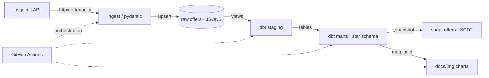

# Poznań IT Market


A daily data pipeline that collects IT job postings from justjoin.it, tracks how they change over time, and shows how the Poznań tech job market evolves.


## Why this exists

Public reports on the Polish IT market are quarterly and nationwide. As a student looking for my first job, I wanted daily and local data.

I also wanted to learn by building a system that deals with real data engineering problems: handling API pagination, saving raw data safely, building dimensional models in dbt, and automating runs with GitHub Actions.

## What it does

- Pulls job postings daily from the justjoin.it public API with retries and validation.
- Saves raw responses unchanged in PostgreSQL as JSONB so data is never lost.
- Transforms data with dbt into staging views and dimensional marts.
- Tracks salary and offer status changes over time (SCD Type 2 snapshots).
- Runs data quality tests (freshness, completeness, referential integrity).
- Generates trend charts automatically after each run.

## Architecture



## Stack

- **Python 3.12** — data ingestion, validation, and chart generation
- **PostgreSQL 16** — database for raw JSONB payloads and analytics marts
- **dbt-core** — SQL transformations, dimensional models, and automated tests
- **Docker Compose** — local PostgreSQL container
- **GitHub Actions** — automated daily runs and failure alerts via email
- **Pydantic & Tenacity** — API data validation and HTTP retries
- **matplotlib** — generating charts saved to documentation

## Getting Started

To run the project locally:

```bash
cp .env.example .env                                # fill in database local credentials
cp dbt/profiles.yml.example dbt/profiles.yml        # set up local dbt profile
make db-up                                          # start PostgreSQL in Docker (remember to start Docker locally)
make migrate                                        # apply initial DDL schemas and tables
make ingest && make dbt                             # fetch raw data, transform models and run tests
```

To regenerate charts manually:

```bash
uv run python scripts/make_charts.py
```

## What the data shows

- **Junior postings:** The chart shows the share of listings marked as `junior`. Demo results do not describe the current market.
- **Salary transparency:** About **20%** of postings do not disclose salary ranges (these are excluded from salary stats to avoid misleading averages).
- **Core technologies:** Python and SQL are the most frequently requested skills across backend and data roles.

## Limitations

- **Single source:** Currently tracks only justjoin.it. Adding No Fluff Jobs is planned next.
- **Location:** Includes listings with top-level `city` equal to `Poznań` or `Poznan`, including remote jobs. Other cities are not counted.
- **Disclosed salaries only:** Missing salary ranges are treated as missing data, not zero.

## Documentation

- [Data sources & API traps](docs/sources.md)
- [Data model & grain](docs/data-model.md)
- [Architecture decisions (ADRs)](docs/decisions.md)
- [Data quality tests](docs/data-quality.md)
- [Database indexes experiment](docs/indexes.md)

## Orchestration & Alerting

The pipeline runs automatically once a day at 6:00 CET using GitHub Actions.
Alerting is handled natively by GitHub Actions, which sends email notifications if a scheduled run or test fails. There is no need for extra third-party tools, achieving a zero-maintenance design.

## Status

Educational project in active development, running daily via GitHub Actions.
