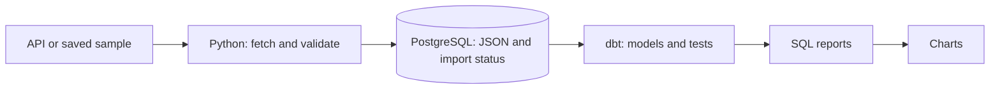

# Poznań IT Market


A Python and SQL project that collects JustJoinIT offers and builds reports for Poznań.
I built it while looking for my first IT job and learning data engineering.

## How it works



Stack: Python 3.14, PostgreSQL 16, dbt, Docker Compose and GitHub Actions.

## Local setup

You need uv, Docker Compose and Make.
On Windows, use WSL with Docker Desktop integration.

For a new setup, keep the local settings from `.env.example`:

```bash
cp .env.example .env
make install
make db-prepare
make demo
```

`make demo` loads the saved sample, builds models and creates charts in `docs/img/`.
It uses a separate local demo database. No API or Neon access is needed.
The sample date and path are defined in `src/poznan_it_market/config.py`.

For another local port, change `POSTGRES_PORT` in `.env`.

## Checks

```bash
make lint
uv run --locked mypy src
make test
```

Tests use a separate database through `TEST_DATABASE_URL`.
Use `make format` to fix formatting.

## Live collection

With the local database settings:

```bash
make migrate
make ingest
make dbt
make charts
```

These commands use `DATABASE_URL`.
GitHub Actions runs the live pipeline daily at **04:00 UTC**.
Charts are uploaded as `market-charts` after the checks pass.

## Example


The [sample](data/raw/sample/jjit_2026-08-11.json) is dated **2026-08-11**.
It contains 10 offers. The city filter keeps **5**, including **1 junior offer (20%)**.
Run `make demo` to repeat this example.

One day is not a trend. The demo image is a saved example.
Live observations start on **2026-10-09**. Old sample imports are excluded from live reports.

## Live results


The live chart is updated after successful daily runs. Its period is shown below the plot.

On **2026-10-09 (UTC)**, **1,263 offers** passed the city filter.
Python appeared in **312 offers**, and SQL in **231**.
[Saved skills chart](docs/img/live-2026-10-09/top_skills.png),
[offer count](docs/img/live-2026-10-09/postings_over_time.png).
This is a one-day result, not a trend.

## What the reports mean

- Daily counts show offers seen on each UTC day.
- Company, skill and salary summaries use each offer's latest observation within the selected period.
- Juniors have `experienceLevel = 'junior'`. Skills count offers mentioning each skill.
- Salaries use original PLN amounts, grouped by contract, hour/month and gross/net.
  The salary chart shows the mean advertised minimum. Missing salary is not zero.

## Limits

There is one source. Reports include top-level `city` equal to `Poznań` or `Poznan`,
including remote jobs. Other location fields are not checked.

A saved offer may no longer be active.
Salary changes show differences between observations, not the exact time of a change.

## Documentation

- [Data model](docs/data-model.md)
- [Source](docs/sources.md)
- [Data quality](docs/data-quality.md)
- [Decisions](docs/decisions.md)
