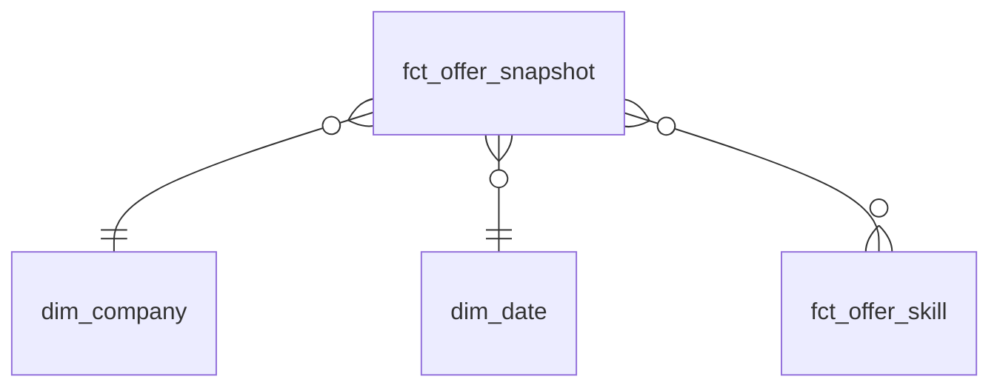

1. How does number of junior postings in Poznań change per week?
2. Which technologies and skills have the highest demand for junior candidates, and which most frequently appear together?
3. How many postings changed their salary range over time, and in which direction?
4. What percentage of postings have visible salary ranges, and does it change based on experience?
5. Which companies publish the most postings, and how long do their postings remain active?

## Fact table grain

`fct_offer_snapshot` — **one row = one posting observed on one day.**
I choose daily snapshots instead of one row per posting because of tracking changes over time (like trends). It uses more storage, but storing one row per posting gives us much less information. It cannot track changes.

## Diagram

## Slowly changing dimensions
`dim_company` — SCD Type 1. Historical company names carry no value.
`snap_offers` — SCD Type 2. A change in salary range or posting status creates a new row with `valid_from` - `valid_to`. It lets me answer for example: how many postings lowered their salary within 1 month.
