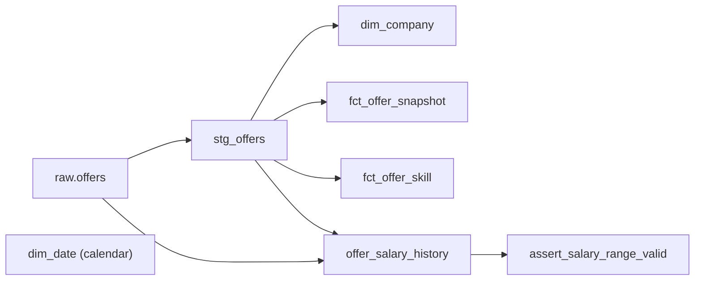

# Data model

## Raw data

| Table | One row means |
|---|---|
| `raw.offers` | An offer seen on one UTC day, with its original JSON |
| `raw.rejected_records` | A rejected record with its error and import ID |
| `raw.ingestion_runs` | An import attempt with its status, mode and counters |

`source_offer_id` identifies a listing within a source.
`raw_offer_id` identifies an observation. `run_id` identifies an import attempt.

The offer key is `(source, source_offer_id, UTC date of fetched_at)`.
A same-day repeat updates the payload and `run_id`. Missing offers stay saved.
The next day adds a new observation. Earlier versions from the same day are replaced.

## Data modes

| Mode | Meaning |
|---|---|
| `live` | API data |
| `demo` | Saved sample |
| `legacy_demo` | Old sample imports |
| `unknown` | Unconfirmed source |

A past review found 30 Neon rows matching the sample.
They were marked `legacy_demo`; their rows and timestamps were kept.

Models use `live` by default. Demo builds use `demo`.
Both exclude `legacy_demo` and `unknown`.

## dbt models

| Model | One row means | Stored as |
|---|---|---|
| `stg_offers` | An observation in the selected mode and city | View |
| `dim_date` | A calendar day | Table |
| `dim_company` | A normalized company name | View |
| `fct_offer_snapshot` | An offer seen on one UTC day | Table |
| `fct_offer_skill` | A skill linked to an observation | Table |
| `offer_salary_history` | An original salary variant for an observation | View |

Offer facts link to company and date dimensions. Skills link to a specific observation.
Company names use `lower(trim(company_name))`; the key is its MD5 hash.
Skills are trimmed, lowercased and deduplicated.

Tables are fully rebuilt from retained raw data.
`fct_offer_snapshot` holds daily observations, not dbt SCD2 snapshots.
Salary amounts come from `fromPerUnit` and `toPerUnit`.

## dbt lineage

Arrows show dbt inputs. `dim_date` builds its own calendar.

```mermaid
flowchart LR
    raw["raw.offers"] --> staging["stg_offers"]
    staging --> companies["dim_company"]
    staging --> facts["fct_offer_snapshot"]
    staging --> skills["fct_offer_skill"]
    staging --> salaries["offer_salary_history"]
    raw --> salaries
    salaries --> salary_test["assert_salary_range_valid"]
    dates["dim_date (calendar)"]
```

## Report rules

Daily reports count offer-day observations.
Other summaries use the latest observation per offer within the selected period.

Salary averages use PLN and give each offer the same weight within a group.
For multiple variants, the offer's value is their average minimum salary.

Salary changes use `LAG()` for the same source, offer, contract, currency, unit and gross/net basis.
The date filter comes after the comparison, so an older observation can be the baseline.
Missing amounts or gross/net information stay missing.

## One offer through the system

Example data and IDs below are made up.

1. The API returns slug `example-python`, company `Example`, city `Poznań`,
   level `junior`, skill `Python` and a monthly B2B net PLN range of 10,000–15,000.
2. Python validates the offer and keeps its original JSON.
3. The import saves it with source `justjoin.it`, `source_offer_id = example-python`,
   `raw_offer_id = 101` and the import's `run_id`.
   Its observation day comes from `fetched_at`, not the publication date.
4. dbt creates one offer-day row, a linked `python` skill row and a salary variant.
5. If this were the only offer that day, the report would show one offer and 100% juniors.
   Its salary group would have a mean advertised minimum of PLN 10,000.
6. A same-day repeat updates observation 101. The next day creates another, such as 102.

Across both days, daily counts include two observations.
Company and skill summaries count one unique offer using observation 102.
A report for only the first day uses observation 101.
