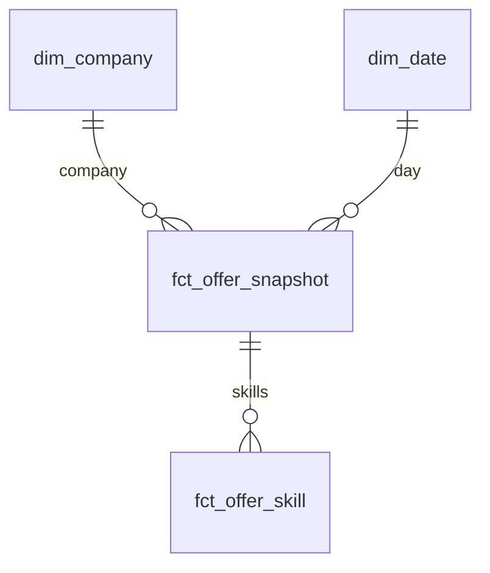

# Data model

## Questions

1. How many offers are seen each day, and what share are junior offers?
2. Which skills appear most often in the selected period?
3. Which salary ranges changed between saved observations?
4. What share of offers disclose full or partial salary ranges?
5. Which companies have the most unique offers in the selected period?

## Raw data

- `raw.offers`: one offer observed on one UTC day. Original offer JSON is kept in `payload`.
- `raw.rejected_records`: rejected records, validation errors and their import IDs.
- `raw.ingestion_runs`: one row per recorded import attempt, with status, date, mode and counters.

An offer ID identifies a listing. `raw_offer_id` identifies a saved observation.
`run_id` identifies an import attempt.

The raw offer key is `(source, source_offer_id, UTC date of fetched_at)`.
A repeat on the same day updates the offer. Offers missing from that repeat remain saved.
The next day creates a new observation.

## dbt models

| Model | One row means | Materialization |
|---|---|---|
| `stg_offers` | An observation in the selected mode and city | View |
| `dim_date` | One calendar day | Table |
| `dim_company` | One normalized company name | View |
| `fct_offer_snapshot` | One offer observed on one UTC day | Table |
| `fct_offer_skill` | One normalized skill for an offer observation | Table |
| `latest_offers` | The latest saved observation of an offer | View |
| `offer_salary_history` | One distinct original salary variant for an observation | View |
| `offer_salaries` | A salary variant from the latest saved observation | View |

Models use `data_mode=live` by default. Demo builds use `data_mode=demo`.
Rows marked `unknown` or `legacy_demo` are excluded from both modes.

## Relationships

```mermaid
erDiagram
    dim_company ||--o{ fct_offer_snapshot : company
    dim_date ||--o{ fct_offer_snapshot : day
    fct_offer_snapshot ||--o{ fct_offer_skill : skills
```

One offer observation can have several skills. Skill names are trimmed, lowercased and deduplicated.
Company names are grouped using `lower(trim(company_name))`; the company key is its MD5 hash.

## History and reports

Facts are rebuilt from retained raw observations. `dim_company` is a view over those observations.
The dbt SCD2 snapshot is disabled and kept as a learning example. Existing snapshot history is kept.

Daily charts count offer-day observations. Company, skill and salary summaries use the latest
observation per offer within the selected period. The latest saved observation does not prove
that a listing is still active.

Salary changes use `LAG()` within the same source, offer, contract, currency, unit and gross/net basis.
The period filter is applied after comparing observations, so an earlier observation can provide
the baseline. Changes are detected at observation time; their exact time is unknown.
